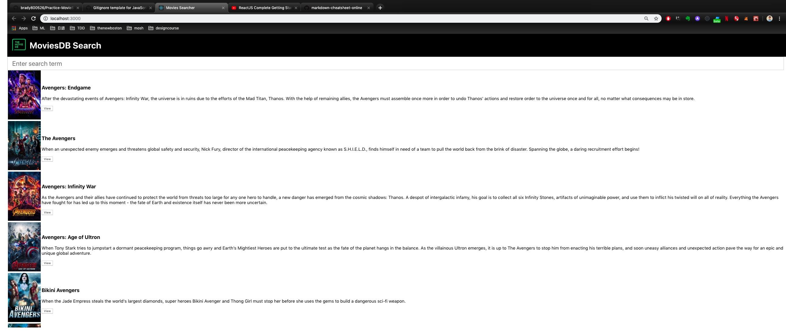

## Overview

This repo is a practice of using Javascript React Framework with ajax to build a movies search platform.
When user type in the name of the movie, the movies results is showed on change.

_All the step is followed by [youtube channel](https://www.youtube.com/watch?v=bqSSLr8A8PU) created by Lets Build That App._

## Goal

This app includes three steps

- Search movies by input
- Ajax request to get all movies
- Put the result on MovieRow componet

## Pages

<figure style="text-align: center;">
    
    <figcaption style="display: block;">Landing Page</figcaption>
</figure>

By input the search above, you can get the results from that.

## Usage

Download the repo, and under the directory:

    npm install

and config your api key of [Movie api](https://developers.themoviedb.org/3/search/search-movies).

    npm start

It will direct open the page with default 3000 port

## Code

#### Input search

```
<input
    onChange={this.searchChangeHandler.bind(this)}
    placeholder="Enter search term"
/>

```

When there is a input change, will trigger the searchChangeHandler function. We have to bind searchChangeHandler to self otherwise the searchChangeHandler will refer to function scope.

#### searchChangeHandler

```
searchChangeHandler(event) {
    const boundObjet = this;
    const searchTerm = event.target.value;
    boundObjet.performSearch(searchTerm);
  }
```

When this functions is triggered, it will use performSearch function.

```

performSearch(searchTerm) {
    const api_key = "It should be your api key";
    const urlString = `https://api.themoviedb.org/3/search/movie?query=marvel&api_key=${api_key}&query=${searchTerm}`;
    $.ajax({
      url: urlString,
      success: (searchResults) => {
        const results = searchResults.results;
        console.log(results[0]);

        var movieRows = [];

        results.forEach((movie) => {
          movie.poster_src =
            "https://image.tmdb.org/t/p/w185" + movie.poster_path;
          // console.log(movie.poster_path);
          const movieRow = <MovieRow key={movie.id} movie={movie} />;
          movieRows.push(movieRow);
        });

        this.setState({rows: movieRows});
      }
    });
  }
```

Depends on the search result, use ajax request to query the movie search results and callback to the results array and update the state of the app.

#### Movie Row Component

```
class MovieRow extends React.Component {
  render() {
    return (
      <div>
        <table key={this.props.movie.id}>
          <tbody>
            <tr>
              <td>
                
              </td>
              <td>
                <h3>{this.props.movie.title}</h3>
                <p>{this.props.movie.overview}</p>
                <input
                  type="button"
                  onClick={this.viewMovie.bind(this)}
                  value="View"
                />
              </td>
            </tr>
          </tbody>
        </table>
      </div>
    );
  }
}
```

The row component will update the content by the props.

## Conclusion

In this project, we connect MySQL with guestbook page. Save each comment when guest leaving the comment on the sign up page. Finally, show all the comments on the landing page.
